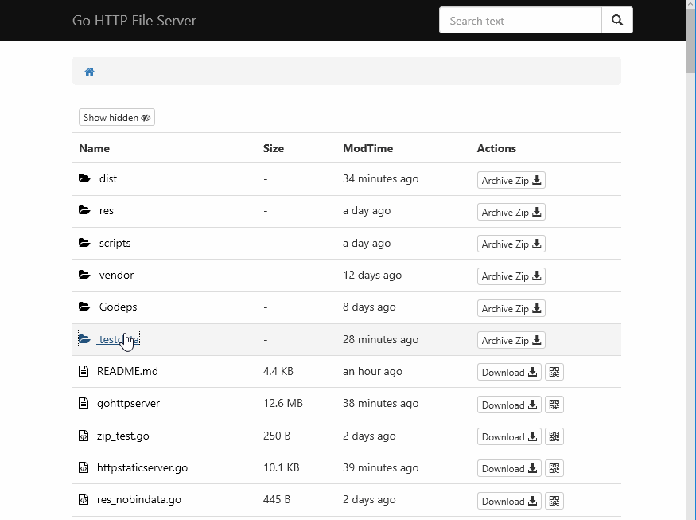

# gohttpserver
[](https://travis-ci.org/codeskyblue/gohttpserver)
[](https://hub.docker.com/repository/docker/codeskyblue/gohttpserver)

- Goal: Make the best HTTP File Server.
- Features: Human-friendly UI, file uploading support, direct QR-code generation for Apple & Android install package.

[Demo site](https://gohttpserver.herokuapp.com/)

- 目标: 做最好的HTTP文件服务器
- 功能: 人性化的UI体验，文件的上传支持，安卓和苹果安装包的二维码直接生成。

**Binaries** can be downloaded from [this repo releases](https://github.com/codeskyblue/gohttpserver/releases/)

## Requirements
Tested with go-1.16

## Screenshots


## Features
1. [x] Support QRCode code generate
1. [x] Breadcrumb path quick change
1. [x] All assets package to Standalone binary
1. [x] Different file type different icon
1. [x] Support show or hide hidden files
1. [x] Upload support (auth by token or session)
1. [x] README.md preview
1. [x] HTTP Basic Auth
1. [x] Partial reload pages when directory change
1. [x] When only one dir under dir, path will combine two together
1. [x] Directory zip download
1. [x] Apple ipa auto generate .plist file, qrcode can be recognized by iphone (Require https)
1. [x] Plist proxy
1. [ ] Download count statistics
1. [x] CORS enabled
1. [ ] Offline download
1. [ ] Code file preview
1. [ ] Edit file support
1. [x] Global file search
1. [x] Hidden work `download` and `qrcode` in small screen
1. [x] Theme select support
1. [x] OK to working behide Nginx
1. [x] \.ghs.yml support (like \.htaccess)
1. [ ] Calculate md5sum and sha
1. [ ] Folder upload
1. [ ] Support sort by size or modified time
1. [x] Add version info into index page
1. [ ] Add api `/-/info/some.(apk|ipa)` to get detail info
1. [x] Add api `/-/apk/info/some.apk` to get android package info
1. [x] Auto tag version
1. [x] Custom title support
1. [x] Support setting from conf file
1. [x] Quick copy download link
1. [x] Show folder size
1. [x] Create folder
1. [x] Skip delete confirm when alt pressed
1. [x] Support unzip zip file when upload(with form: unzip=true)

## Installation
```bash
$ go install github.com/codeskyblue/gohttpserver@latest
```

Or download binaries from [github releases](https://github.com/codeskyblue/gohttpserver/releases)

If you are using Mac, simply run command

```bash
$ brew install codeskyblue/tap/gohttpserver
```

## Usage
Listen on port 8000 of all interfaces, and enable file uploading.

```
$ gohttpserver -r ./ --port 8000 --upload
```

Use command `gohttpserver --help` to see more usage.

## Docker Usage
share current directory

```bash
$ docker run -it --rm -p 8000:8000 -v $PWD:/app/public --name gohttpserver codeskyblue/gohttpserver
```

Share current directory with http basic auth

```bash
$ docker run -it --rm -p 8000:8000 -v $PWD:/app/public --name gohttpserver \
  codeskyblue/gohttpserver \
  --auth-type http --auth-http username:password
```

Share current directory with openid auth. (Works only in netease company.)

```bash
$ docker run -it --rm -p 8000:8000 -v $PWD:/app/public --name gohttpserver \
  codeskyblue/gohttpserver \
  --auth-type openid
```

To build image yourself, please change the PWD to the root of this repo.

```bash
$ cd gohttpserver/
$ docker build -t codeskyblue/gohttpserver -f docker/Dockerfile .
```

## Authentication options
- Enable basic http authentication

  ```sh
  $ gohttpserver --auth-type http --auth-http username:password
  ```

- Use openid auth

  ```sh
  $ gohttpserver --auth-type openid --auth-openid https://login.example-hostname.com/openid/
  ```

- Use oauth2-proxy with

  ```sh
  $ gohttpserver --auth-type oauth2-proxy
  ```
  You can configure to let a http reverse proxy handling authentication. 
  When using oauth2-proxy, the backend will use identification info from request headers `X-Auth-Request-Email` as userId and `X-Auth-Request-Fullname` as user's display name. 
  Please config your oauth2 reverse proxy yourself.
  More about [oauth2-proxy](https://github.com/oauth2-proxy/oauth2-proxy).
  
  All required headers list as following.

  |header|value|
  |---|---|
  |X-Auth-Request-Email| userId |
  |X-Auth-Request-Fullname| user's display name(urlencoded) |
  |X-Auth-Request-User| user's nickname (mostly email prefix) |

- Enable upload

  ```sh
  $ gohttpserver --upload
  ```

- Enable delete and Create folder

  ```sh
  $ gohttpserver --delete
  ```

## Advanced usage
Add access rule by creating a `.ghs.yml` file under a sub-directory. An example:

```yaml
---
upload: false
delete: false
users:
- email: "codeskyblue@codeskyblue.com"
  delete: true
  upload: true
  token: 4567gf8asydhf293r23r
```

In this case, if openid auth is enabled and user "codeskyblue@codeskyblue.com" has logged in, he/she can delete/upload files under the directory where the `.ghs.yml` file exits.

`token` is used for upload. see [upload with curl](#upload-with-curl)

For example, in the following directory hierarchy, users can delete/uploade files in directory `foo`, but he/she cannot do this in directory `bar`.

```
root -
  |-- foo
  |    |-- .ghs.yml
  |    `-- world.txt 
  `-- bar
       `-- hello.txt
```

User can specify config file name with `--conf`, see [example config.yml](testdata/config.yml).

To specify which files is hidden and which file is visible, add the following lines to `.ghs.yml`

```yaml
accessTables:
- regex: block.file
  allow: false
- regex: visual.file
  allow: true
```

### ipa plist proxy
This is used for server on which https is enabled. default use <https://plistproxy.herokuapp.com/plist>

```bash
$ gohttpserver --plistproxy=https://someproxyhost.com/
```

Test if proxy works:

```sh
$ http POST https://someproxyhost.com/plist < app.plist
{
	"key": "18f99211"
}
$ http GET https://someproxyhost.com/plist/18f99211
# show the app.plist content
```

If your ghs running behide nginx server and have https configed. plistproxy will be disabled automaticly.

### Upload with CURL
For example, upload a file named `foo.txt` to directory `somedir`

```sh
$ curl -F file=@foo.txt localhost:8000/somedir
{"destination":"somedir/foo.txt","success":true}
# upload with token
$ curl -F file=@foo.txt -F token=12312jlkjafs localhost:8000/somedir
{"destination":"somedir/foo.txt","success":true}

# upload and change filename
$ curl -F file=@foo.txt -F filename=hi.txt localhost:8000/somedir
{"destination":"somedir/hi.txt","success":true}
```

Upload zip file and unzip it (zip file will be delete when finished unzip)

```
$ curl -F file=@pkg.zip -F unzip=true localhost:8000/somedir
{"success": true}
```

Note: `\/:*<>|` are not allowed in filenames.

### Deploy with nginx
Recommended configuration, assume your gohttpserver listening on `127.0.0.1:8200`

```
server {
  listen 80;
  server_name your-domain-name.com;

  location / {
    proxy_pass http://127.0.0.1:8200; # here need to change
    proxy_redirect off;
    proxy_set_header  Host    $host;
    proxy_set_header  X-Real-IP $remote_addr;
    proxy_set_header  X-Forwarded-For $proxy_add_x_forwarded_for;
    proxy_set_header  X-Forwarded-Proto $scheme;

    client_max_body_size 0; # disable upload limit
  }
}
```

gohttpserver should started with `--xheaders` argument when behide nginx.

Refs: <http://nginx.org/en/docs/http/ngx_http_core_module.html#client_max_body_size>

gohttpserver also support `--prefix` flag which will help to when meet `/` is occupied by other service. relative issue <https://github.com/codeskyblue/gohttpserver/issues/105>

Usage example:

```bash
# for gohttpserver
$ gohttpserver --prefix /foo --addr :8200 --xheaders
```

**Nginx settigns**

```
server {
  listen 80;
  server_name your-domain-name.com;

  location /foo {
    proxy_pass http://127.0.0.1:8200; # here need to change
    proxy_redirect off;
    proxy_set_header  Host    $host;
    proxy_set_header  X-Real-IP $remote_addr;
    proxy_set_header  X-Forwarded-For $proxy_add_x_forwarded_for;
    proxy_set_header  X-Forwarded-Proto $scheme;

    client_max_body_size 0; # disable upload limit
  }
}
```

## FAQ
- [How to generate self signed certificate with openssl](http://stackoverflow.com/questions/10175812/how-to-create-a-self-signed-certificate-with-openssl)

### How the query is formated
The search query follows common format rules just like Google. Keywords are seperated with space(s), keywords with prefix `-` will be excluded in search results.

1. `hello world` means must contains `hello` and `world`
1. `hello -world` means must contains `hello` but not contains `world`

## Developer Guide
Depdencies are managed by [govendor](https://github.com/kardianos/govendor)

1. Build develop version. **assets** directory must exists

  ```sh
  $ go build
  $ ./gohttpserver
  ```
2. Build single binary release

  ```sh
  $ go build
  ```

Theme are defined in [assets/themes](assets/themes) directory. Now only two themes are available, "black" and "green".


## Reference Web sites

* Core lib Vue <https://vuejs.org.cn/>
* Icon from <http://www.easyicon.net/558394-file_explorer_icon.html>
* Code Highlight <https://craig.is/making/rainbows>
* Markdown Parser <https://github.com/showdownjs/showdown>
* Markdown CSS <https://github.com/sindresorhus/github-markdown-css>
* Upload support <http://www.dropzonejs.com/>
* ScrollUp <https://markgoodyear.com/2013/01/scrollup-jquery-plugin/>
* Clipboard <https://clipboardjs.com/>
* Underscore <http://underscorejs.org/>

**Go Libraries**

* [vfsgen](https://github.com/shurcooL/vfsgen) Not using now
* [go-bindata-assetfs](https://github.com/elazarl/go-bindata-assetfs) Not using now
* <http://www.gorillatoolkit.org/pkg/handlers>

## History
The old version is hosted at <https://github.com/codeskyblue/gohttp>

## LICENSE
This project is licensed under [MIT](LICENSE).
