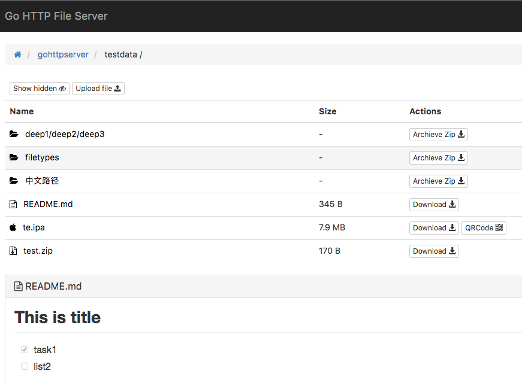

# gohttpserver
Make the best HTTP File Server.

> Rewrite from https://github.com/codeskyblue/gohttp with golang+vue

## Notes
If using go1.5, ensure you set GO15VENDOREXPERIMENT=1

Upload size now limited to 1G

## Screenshots


## Features
1. [x] Support QRCode code generate
1. [x] Breadcrumb path quick change
1. [x] All assets package to Standalone binary
1. [x] Different file type different icon
1. [x] Support show or hide hidden files
1. [x] Upload support (for security reason, you need enabled it by option `--upload`)
1. [x] README.md preview
1. [ ] Code file preview
1. [x] HTTP Basic Auth
1. [x] Partial reload pages when directory change
1. [x] When only one dir under dir, path will combine two together
1. [x] Directory zip download
1. [x] Apple ipa auto generate .plist file, qrcode can be recognized by iphone (Require https)
1. [x] Plist proxy
1. [ ] Download count statistics
1. [x] CORS enabled
1. [ ] Offline download
1. [ ] Edit file support
1. [ ] Global file search
1. [x] Hidden work `download` and `qrcode` in small screen
1. [x] Theme select support
1. [x] OK to working behide Nginx
1. [ ] \.htaccess support
1. [ ] Calculate md5sum and sha
1. [ ] Folder upload
1. [ ] Support sort by size or modified time
1. [ ] Add version info into index page
1. [ ] Add api `/-/stat/some.(apk|ipa)` to get detail info

## Installation
```
go get -v github.com/codeskyblue/gohttpserver
cd $GOPATH/src/github.com/codeskyblue/gohttpserver
go build && ./gohttpserver
```

## Usage
Listen port 8000 on all interface, and enable upload

```
./gohttpserver -r ./ --addr :8000 --upload
```

### ipa plist proxy
This is used for server which not https enabled.

```
./gohttpserver --plistproxy=https://someproxyhost.com/
```

Proxy web site should have ability, when request `https://proxyhost.com/www.github.com`
return the same page as request from `http://www.github.com`

### Upload with CURL
For example, upload a file named `foo.txt` to directory `somedir`

PS: max upload size limited to 1G (hard coded)

```sh
$ curl -F file=@foo.txt localhost:8000/somedir
```

## FAQ
- [How to generate self signed certificate with openssl](http://stackoverflow.com/questions/10175812/how-to-create-a-self-signed-certificate-with-openssl)

## Developer Guide
Depdencies are managed by godep

```sh
go get -v github.com/tools/godep
go get github.com/jteeuwen/go-bindata/...
go get github.com/elazarl/go-bindata-assetfs/...
```

Theme are all defined in [res/themes](res/themes) directory. Now only two, black and green.

## How to build single binary release
```sh
go-bindata-assetfs -tags bindata res/...
go build -tags bindata
```

That's all. ^_^

## Reference Web sites

* <https://vuejs.org.cn/>
* Icon from <http://www.easyicon.net/558394-file_explorer_icon.html>
* <https://github.com/elazarl/go-bindata-assetfs>
* Code Highlight <https://craig.is/making/rainbows>
* Markdown-JS <https://github.com/showdownjs/showdown>
* <https://github.com/sindresorhus/github-markdown-css>
* <http://www.gorillatoolkit.org/pkg/handlers>
* <http://www.dropzonejs.com/>

## LICENSE
This project is under license [MIT](LICENSE)
